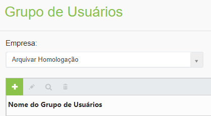
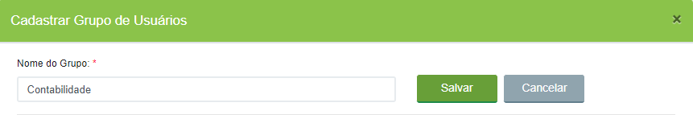
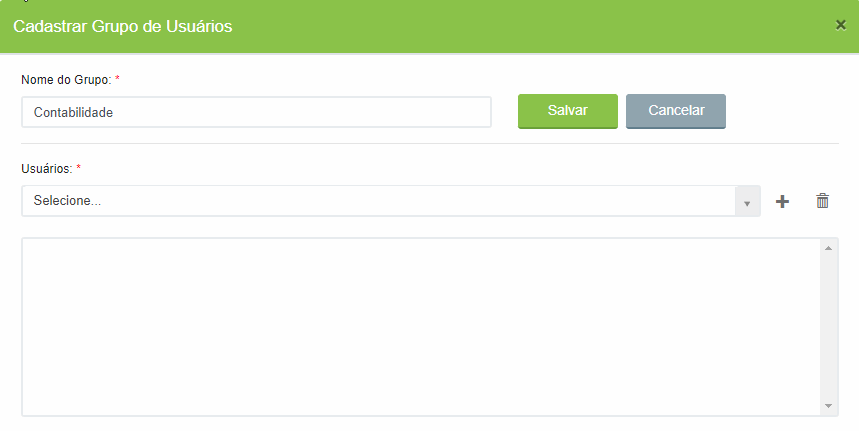
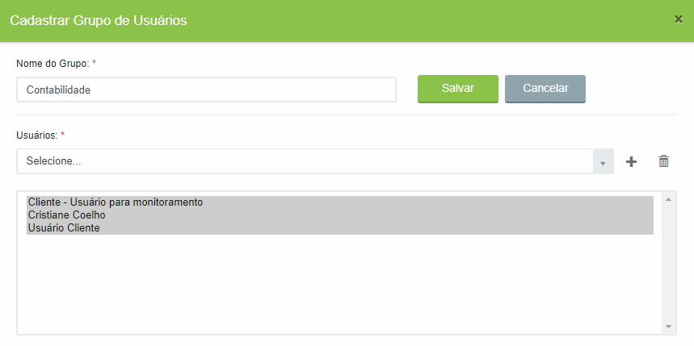
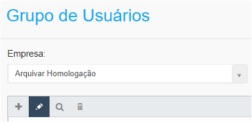
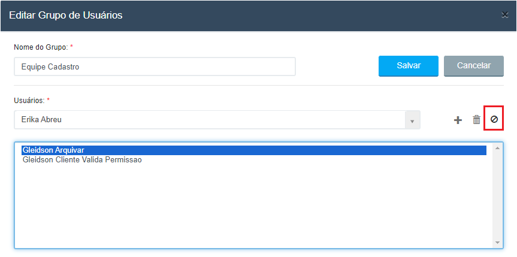

# 🟩 Grupo de Usuários

Grupos de Usuários no WorkFlow são um conjunto de usuários que serão responsáveis por uma tarefa durante a execução de um processo. Muitas vezes uma tarefa pode ser executada por qualquer um dos membros de um setor, ou uma mesma tarefa demanda que mais de uma pessoa a execute devido à complexidade da sua execução, por exemplo. Nestes casos a tarefa será delegada a um grupo de pessoas e não a um usuário específico.&#x20;

&#x20;A distribuição de tarefas delegadas a um grupo a seus membros será determinada durante a [Configuração da Tarefa no Desenho do Fluxo.](desenho-do-fluxo/aba-fluxograma.md#configuracoes-da-tarefa)

***

## &#x20;Grupo de Usuários – Tela principal

**1. Campo Empresa:** Neste campo é exibida a empresa ou empresas às quais o usuário logado pertence ou tem acesso.&#x20;

**2. Ícone Adicionar:** Utilizado para o cadastro de um novo grupo de usuários.&#x20;

**3. Ícone Editar:** Utilizado para realizar a edição do grupo de usuários selecionado. &#x20;

**4. Ícone Visualizar:** Utilizado para visualizar detalhes do grupo de usuários selecionado. &#x20;

**5. Ícone Excluir:** Utilizado para excluir o grupo de usuários selecionado.&#x20;

**6. Coluna Nome do Grupo de Usuários:** Nesta coluna são exibidos todos os grupos de usuários da empresa cadastrados.

<figure><figcaption>
Clique na imagem para ampliar.
</figcaption></figure>

***

## Cadastro de Grupo de Usuários

1. Clique no ícone “Adicionar”.

<figure><figcaption></figcaption></figure>

2. Insira o “Nome do Grupo”.

<figure><figcaption></figcaption></figure>

3. Insira os usuários que irão compor o grupo selecionando cada um e clicando no ícone “+”.

<figure><figcaption>
Clique na imagem para ampliar.
</figcaption></figure>

4. Para remover um usuário do grupo, selecione-o e clique no ícone “Remover usuário” (Lixeira).


<mark style="color:orange;">**Não é possível excluir todos os usuários de um grupo salvo. É preciso que ao menos um usuário permaneça. Para excluir o grupo definitivamente, utilize clique no ícone “Excluir” da tela principal.**</mark>


<figure><figcaption>
Clique na imagem para ampliar.
</figcaption></figure>

5. Para concluir, clique em “Salvar”.

***

## Inativar usuários

É possível inativar um usuário do grupo para que ele não receba tarefas para execução, sem a necessidade de excluí-lo do grupo.

1. Para isso, na tela principal selecione o grupo de usuários que deseja editar e clique no ícone "Editar".

<figure><figcaption></figcaption></figure>

2. Selecione o usuário que deseja inativar e clique no ícone "Ativação/Inativação do Usuário".
3. Clique em "Salvar".

<figure><figcaption>
Clique na imagem para ampliar.
</figcaption></figure>

4. Usuários inativados em um grupo não irão receber novas tarefas que estejam configuradas para o grupo em questão. Se quiser ativar o usuário novamente, basta retornar à tela, selecionar o usuário e clicar novamente no ícone "Ativação/Inativação do Usuário".
