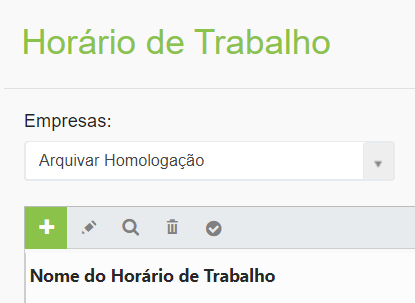
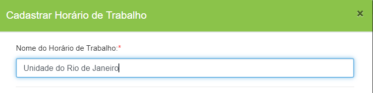
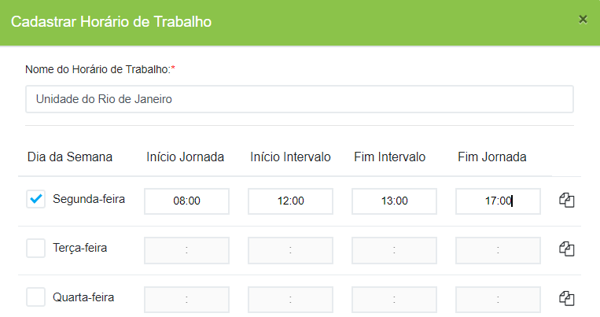
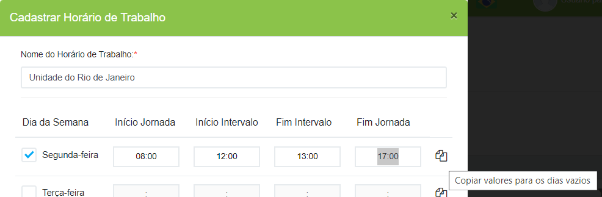
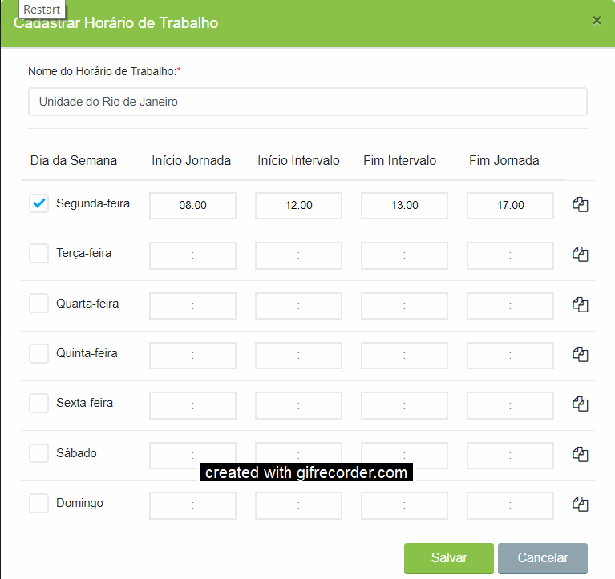
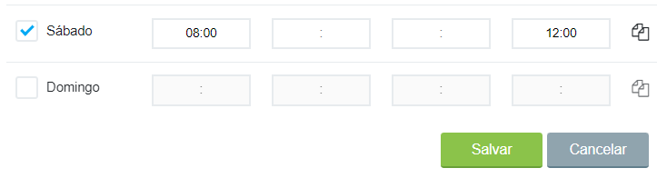

# 🟩 Horários de Trabalho

O menu Horários de Trabalho objetiva sinalizar ao sistema informações importantes que devem ser consideradas sobre o prazo de execução das tarefas. Neste menu deve ser cadastrado o horário de expediente das unidades e setores da empresa. &#x20;

O cadastro dos horários de trabalho é importante para que o sistema considere o expediente da empresa ou de um funcionário ao fazer a contagem do prazo para execução das tarefas. Empresas com mais de uma unidade, por exemplo, podem ter expedientes diferentes, ou mesmo setores de uma mesma unidade podem funcionar em horários distintos. &#x20;


<mark style="color:blue;">**EXEMPLO:**</mark> <mark style="color:blue;"></mark><mark style="color:blue;">Se um funcionário da empresa trabalha das 8h às 17h e no fim do seu expediente recebe uma tarefa que precisa ser executada em quatro horas, o sistema irá desconsiderar as horas em que ele não está trabalhando e só começará a contar o prazo a partir de 8h do dia seguinte.</mark>


***

## &#x20;Horários de Trabalho – Tela principal

**1. Campo Empresa:** Neste campo é exibida a empresa ou empresas às quais o usuário logado pertence ou tem acesso.&#x20;

**2. Ícone Adicionar:** Utilizado para o cadastro de um novo horário de trabalho. Uma mesma empresa ou unidade pode contar com horários de trabalho distintos.&#x20;

**3. Ícone Editar:** Utilizado para realizar a edição do horário de trabalho selecionado. &#x20;

**4. Ícone Visualizar:** Utilizado para visualizar detalhes do horário de trabalho selecionado. &#x20;

**5. Ícone Excluir:**  Utilizado para excluir o horário de trabalho selecionado.&#x20;

**6. Ícone Selecionar como padrão para usuários externos:** Utilizado para selecionar um dos horários de trabalho como padrão ao considerar o prazo de execução das tarefas por um usuário externo. Esse parâmetro será utilizado durante a Configuração das Tarefas no Desenho do Fluxo.   &#x20;

**7. Coluna Nome do Horário de Trabalho:** Nesta coluna são exibidos todos os horários de trabalho da empresa cadastrados.&#x20;

**8. Coluna Para Usuários Externos:** Nesta coluna é mostrado qual dos horários de trabalho da empresa está sendo utilizado como padrão no direcionamento de tarefas para usuários externos.&#x20;

<figure><figcaption>
Clique na imagem para ampliar.
</figcaption></figure>


<mark style="color:orange;">**Usuários externos são aqueles que executam tarefas no processo fora do ArqGED (deslogados), como fornecedores, clientes etc.**</mark>


***

## Cadastro de Horários de Trabalho

1. Clique no ícone “Adicionar”.

<figure><figcaption></figcaption></figure>

2. Insira um nome para o horário de trabalho.

<figure><figcaption></figcaption></figure>

3. Selecione o primeiro dia da semana que irá compor aquele expediente e insira os horários de início e fim da jornada e início e fim do intervalo.

<figure><figcaption></figcaption></figure>

4. Para replicar os horários nos demais dias da semana, clique no ícone “Copiar valores para os dias vazios”.

<figure><figcaption></figcaption></figure>

5. Todos os dias da semana serão preenchidos. Desmarque aqueles que não devem ser contabilizados.&#x20;

<figure><figcaption></figcaption></figure>

6\. Se não houver intervalo em determinado dia, insira apenas o início e fim da jornada.  &#x20;

7\. Concluído o cadastro, clique em “Salvar”.&#x20;

<figure><figcaption></figcaption></figure>


<mark style="color:orange;">**A atribuição do horário de trabalho de cada usuário deve ser feita no menu Administração > Usuários > Aba Permissões II.**</mark>

