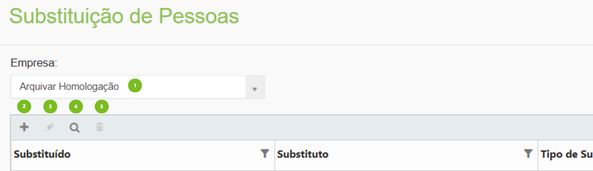
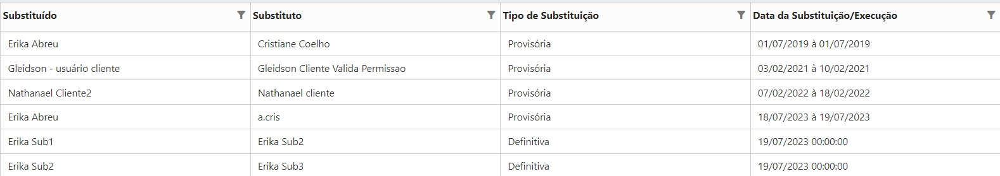
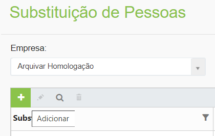
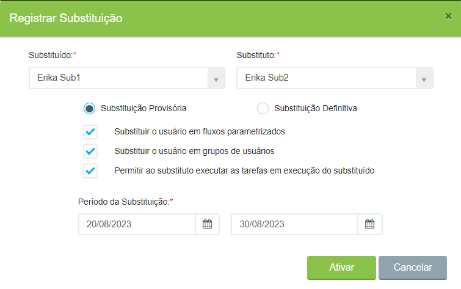
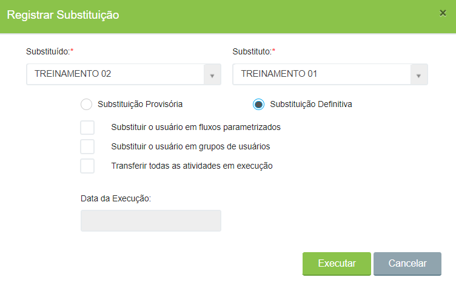

# 🟩 Substituição de Pessoas

A funcionalidade de Substituição de Pessoas é utilizada para substituir uma pessoa que estava cadastrada como responsável por uma tarefa em determinado fluxo por outra pessoa, em caso de desligamento, afastamento, transferência de setor etc.

***

## Substituição de Pessoas – Tela Principal

**1. Campo Empresa:** Neste campo é exibida a empresa ou empresas às quais o usuário logado pertence ou tem acesso.&#x20;

**2. Ícone Adicionar:** Utilizado para a criação de uma nova substituição.&#x20;

**3. Ícone Editar:** Utilizado para realizar a edição das informações da substituição selecionada. Só é possível editar substituições provisórias e que ainda não tenham sido realizadas, ou seja, que estão programadas para datas futuras. Substituições passadas e definitivas não podem ser alteradas. &#x20;

**4. Ícone Visualizar:** Utilizado para visualizar detalhes da substituição selecionada. &#x20;

**5. Ícone Excluir:**  Utilizado para excluir a substituição selecionada. Só é possível excluir substituições provisórias e que ainda não tenham sido realizadas, ou seja, que estão programadas para datas futuras. Não é permitido excluir substituições passadas ou definitivas.&#x20;

<figure><figcaption>
Clique na imagem para ampliar.
</figcaption></figure>

**Coluna Substituído:** Mostra o nome do usuário que está sendo substituído no fluxo.&#x20;

**Coluna Substituto:** Mostra o nome do usuário substituto, que irá assumir as tarefas do substituído no fluxo. &#x20;

**Coluna Tipo de Substituição:** Mostra se a substituição feita é definitiva ou provisória.&#x20;

**Coluna Data da Substituição/Execução:** Mostra o período em que a substituição provisória está vigente (data inicial e data final) ou, no caso de substituição definitiva, o dia e horário em que foi executada.  &#x20;

<figure><figcaption>
Clique na imagem para ampliar.
</figcaption></figure>

***

## &#x20;Substituição Provisória

1. Clique no ícone “Adicionar”.

<figure><figcaption></figcaption></figure>

2\. Selecione o usuário que será substituído e o usuário substituto nos campos correspondentes.&#x20;

3\. Selecione a opção Substituição Provisória. A substituição provisória ocorrerá só no período indicado no campo “Período da Substituição”.

4\. Selecione as opções desejadas em relação à substituição:&#x20;

* Substituir o usuário em fluxos parametrizados: A substituição será feita em todos os fluxos em que o nome do substituído estiver indicado no desenho do fluxo como responsável por alguma tarefa, mesmo em fluxos que ainda não estão em execução.  &#x20;
* Substituir o usuário em grupos de usuários: A substituição será feita em todos os grupos de usuários em que o substituído estiver incluído, ou seja, o substituto será incluído nesses grupos e executará as tarefas que haviam sido delegadas ao substituído. &#x20;
* Permitir ao substituto executar as tarefas em execução do substituído: O substituto deverá executar tarefas do substituído em fluxos que já estão em execução (em andamento).

5\. Informe o período da substituição e clique em “Ativar”.&#x20;

<figure><figcaption></figcaption></figure>

***

## Substituição Definitiva

1. Clique no ícone “Adicionar”.

<figure><figcaption></figcaption></figure>

2\. Selecione o usuário que será substituído e o usuário substituto nos campos correspondentes.&#x20;

3\. Selecione a opção Substituição Definitiva. No caso da substituição definitiva será feita uma mudança no banco de dados, ou seja, o substituído será excluído de todos os fluxos e tarefas em que estiver indicado como responsável e o nome do substituto será inserido.&#x20;

4\. Selecione as opções desejadas em relação à substituição:&#x20;

* Substituir o usuário em fluxos parametrizados: A substituição será feita em todos os fluxos em que o nome do substituído estiver indicado no desenho do fluxo como responsável por alguma tarefa, mesmo em fluxos que ainda não estão em execução.  &#x20;
* Substituir o usuário em grupos de usuários: A substituição será feita em todos os grupos de usuários em que o substituído estiver incluído, ou seja, o substituto será incluído nesses grupos e executará as tarefas que haviam sido delegadas ao substituído. &#x20;
* Transferir todas as atividades em execução: O sistema irá verificar todos os fluxos em execução do cliente e enviar todas as tarefas do usuário substituído para o usuário substituto. Caso uma tarefa precise retornar para execução, será encaminhada para o usuário substituto.&#x20;

5. A data da execução será preenchida automaticamente no momento em que o usuário clicar em “Executar”.

<figure><figcaption></figcaption></figure>

